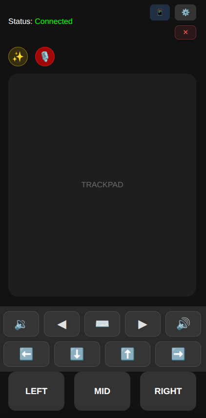
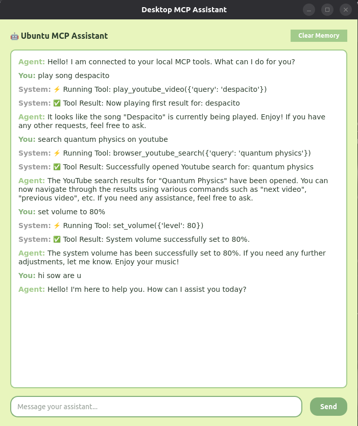

# MCP Remote Agent

A powerful local AI agent built using the **Model Context Protocol (MCP)** and local LLMs (**Ollama/Mistral**) to autonomously execute Operating System-level tasks and manage media.

_Note: This agent is currently optimized for **Ubuntu Linux**. Windows support is planned for future updates._

This project bridges the gap between conversational AI, manual remote control interfaces, and functional OS execution. Instead of just answering questions, the agent dynamically parses natural language (both text and voice dictation), decides which system-level tool is needed, and invokes it seamlessly using an MCP Server-Client architecture.

## 🚀 Key Features

### 🤖 Automation & Autonomous Tools

- **AI Tool Orchestration**: Uses local Mistral models via Ollama to map conversational intents to direct python functions.
- **Automated Media Playback**: Don't just search for songs; the agent utilizes headless HTML scraping to fetch YouTube IDs and auto-plays media instantly.

### 📱 Full Remote PC Control (Web App)

_(Mobile Remote Interface shown below)_

<p align="center">
  
</p>

Alongside the AI agent, the local network server provides a comprehensive remote control suite directly on your phone:

- **Digital Trackpad**: Allows you to manually move the mouse, scroll, and click.
- **Sound Controls**: Dedicated UI buttons for direct PulseAudio/ALSA master volume adjustment.
- **Touch Keyboard Integration**: Full text typing from your mobile device directly to your desktop.
- **Voice Typing**: Utilize mobile WebRTC dictation to write text across the LAN directly into your active PC window.
- **Universal Shortcuts**: One-tap buttons for essential OS commands (Copy/Paste, Tab Switching (Alt+Tab), Forward/Backwards, closing windows via Alt+F4, etc.).

### 🔒 Local, Private, & Free

Powered entirely by local processes. No API limits, no subscription fees, and no audio or chat data leaving your local machine.

---

## 🧠 System Architecture

This project is divided into three core architectural layers:

1. **The Server (`mcp_server.py`)**: A `FastMCP` initialized daemon that holds the actual python OS tools (the "Hands").
2. **The Client/Agent (`agent.py`)**: Acts as the LLM orchestrator. It fetches the available tool schemas dynamically from the server, passes them to Mistral via Ollama, and analyzes intent (the "Brain").
3. **The Interfaces (`desktop_app.py` & `server.py`)**: The frontend wrappers that handle user input (text, speech-to-text, and mouse coordinates) and display agent outputs.

---

## 🛠️ Installation & Setup

### Prerequisites

- Ubuntu / Linux OS
- Python 3.10+
- Local installation of [Ollama](https://ollama.com/)
- Pulseaudio / ALSA mappings (For Linux volume control)
- `pynput` / `evdev` system dependencies (For mouse control plotting)

### 1. Clone & Environment

```bash
git clone https://github.com/Vinayak-Sutar/mcp-remote-agent.git
cd mcp-remote-agent

# Create and activate a virtual environment
python3 -m venv .venv
source .venv/bin/activate

# Install requirements
pip install -r requirements.txt
```

### 2. Startup Ollama

Ensure the Mistral models are pulled and running in the background.

```bash
ollama serve
ollama pull mistral
```

---

## 🎮 Usage

### Method A: The Desktop App (PyQt6)

Launch the standalone chat UI to test operations directly on your PC.

<p align="center">
  
</p>

```bash
# We've provided a simple startup script
./start_chat_interface.sh
```

**Try typing AI commands like:**

- _"Can you set my volume to 80 percent?"_
- _"Play Numb by Linkin Park on YouTube."_
- _"Search for Python tutorials on YouTube."_

### Method B: The Local Voice & Remote Server (Web App)

Allows you to control your PC by speaking or using the digital trackpad/keyboard on your mobile phone while on the same Wi-Fi network.

**1. Generate Self-Signed Certificates** (Required for browser mic access)

```bash
openssl req -x509 -newkey rsa:4096 -nodes -out cert.pem -keyout key.pem -days 365
```

_(Note: Do not commit the generated .pem files to public repositories)_

**2. Start the Server**

```bash
./run_web_server.sh
```

**3. Access from Phone**
Navigate to `https://<YOUR_LOCAL_PC_IP>:5000` on your mobile browser, accept the local security warning, and you can now:

- Press the **microphone** button to speak AI commands.
- Swipe the **virtual trackpad** for mouse operations.
- Utilize the **Shortcut Menu** for UI actions like Tab-Switching, Copy/Paste, Media playback, or closing applications.
- Use **Voice Typing** to rapidly dictate long paragraphs directly to your PC text fields.

---

## 🏗️ Extending the Agent

Because this project utilizes the **Model Context Protocol**, adding new AI capabilities is incredibly easy.

1. Open `mcp_server.py`.
2. Write a standard python function using the `@mcp.tool()` decorator.
3. Include Type-Hints and a Docstring (This is what Mistral reads to understand the tool).

Example:

```python
@mcp.tool()
def take_screenshot(delay_seconds: int) -> str:
    """Takes a screenshot of the main display after a given delay."""
    # Write execution code here...
    return f"Screenshot saved successfully!"
```

4. Restart the agent. The LLM will automatically discover your new tool and know exactly when to use it!
